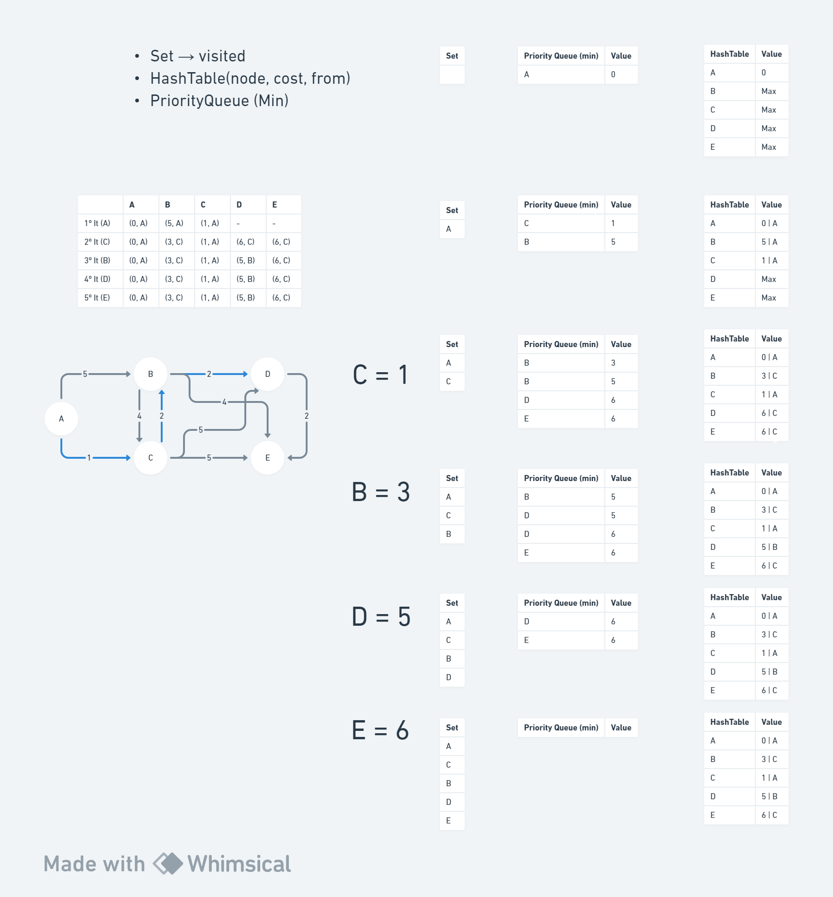
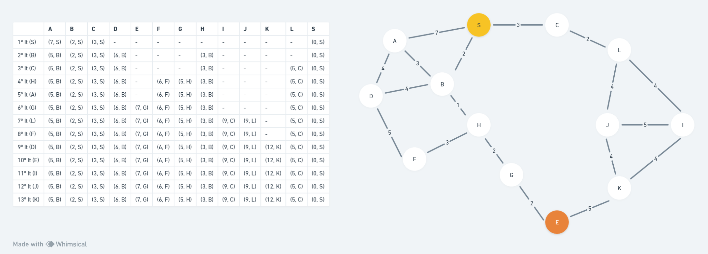

# Algorithm Dijkstra

# Example

[Pseudocode diagram](https://whimsical.com/djikstra-ULBhe3Sp9aVMKBzBiNNQLN)

## Graph 1


## Graph 2


## Python diagram
To run demo 3, you need to install the following packages:

```bash
pip install networkx
pip install matplotlib
```


## References

[usfca.edu](https://www.cs.usfca.edu/~galles/visualization/Dijkstra.html)