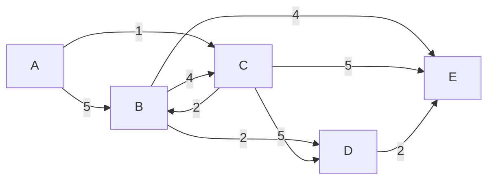

# Graph 1

[Home](README.md)

This is a Directed Graph (Digraph)

## Dijkstra's Algorithm step by step

An easy way to explain Dijkstra's algorithm is to use a table to keep track of the shortest distance from the starting node to each node in the graph. For this example, we will use the graph above.

**Step 1**

Create a table with a number of columns equal to the number of nodes in the graph and also a number of rows equal to the number of iterations we will need to complete the algorithm. Since the number of iterations is equal to the number of nodes in the graph, we will have a table with 5 rows and 5 columns.

|         | A   | B   | C   | D   | E   |
| ------- | --- | --- | --- | --- | --- |
| 1º It() |     |     |     |     |     |
| 2º It() |     |     |     |     |     |
| 3º It() |     |     |     |     |     |
| 4º It() |     |     |     |     |     |
| 5º It() |     |     |     |     |     |

**Step 2**

First, we need to select the starting node. In this case, we will use node 'A' as the starting node. Thus, we will place the symbol 'A' in the iteration column to indicate that the starting node is 'A'. We will also place the number 0 in the column for node 'A' to signify that the shortest distance from the starting node to itself is 0, and the predecessor node to reach 'A' is 'A' itself. (0, A).

|          | A     | B   | C   | D   | E   |
| -------- | ----- | --- | --- | --- | --- |
| 1º It(A) | (0,A) |     |     |     |     |
| 2º It()  |       |     |     |     |     |
| 3º It()  |       |     |     |     |     |
| 4º It()  |       |     |     |     |     |
| 5º It()  |       |     |     |     |     |

**Step 3**

The first principle of Dijkstra's algorithm is that, when we are iterating over a node, we have determined the shortest distance from the starting node to the current node. Thus, we can consider this node as immutable, which is equivalent to marking the node as visited. To indicate this, we will fill the entire column of the node with the same distance and predecessor node, '(0,A)'.

|          | A     | B   | C   | D   | E   |
| -------- | ----- | --- | --- | --- | --- |
| 1º It(A) | (0,A) |     |     |     |     |
| 2º It()  | (0,A) |     |     |     |     |
| 3º It()  | (0,A) |     |     |     |     |
| 4º It()  | (0,A) |     |     |     |     |
| 5º It()  | (0,A) |     |     |     |     |

**Step 4**

Next, we will calculate the distance to the remaining nodes.
* A -> B = 5
* A -> C = 1
* A -> D = Infinity
* A -> E = Infinity

Observe that the distance from A to D and E is Infinity because there is no direct path from A to D and E.

|          | A     | B     | C     | D   | E   |
| -------- | ----- | ----- | ----- | --- | --- |
| 1º It(A) | (0,A) | (5,A) | (1,A) |  ∞  |  ∞  |
| 2º It()  | (0,A) |       |       |     |     |
| 3º It()  | (0,A) |       |       |     |     |
| 4º It()  | (0,A) |       |       |     |     |
| 5º It()  | (0,A) |       |       |     |     |

**Step 5**

Now, we have completed the iteration over node 'A', and we need to select the next node to iterate over. For this, we will choose the node with the shortest accumulated distance so far. In this case, the node is 'C' with an accumulated distance of 1. We will then repeat step 2 to identify the current node and the distance to reach itself.

|          | A     | B     | C     | D   | E   |
| -------- | ----- | ----- | ----- | --- | --- |
| 1º It(A) | (0,A) | (5,A) | (1,A) |  ∞  |  ∞  |
| 2º It(C) | (0,A) |       | (1,A) |     |     |
| 3º It()  | (0,A) |       |       |     |     |
| 4º It()  | (0,A) |       |       |     |     |
| 5º It()  | (0,A) |       |       |     |     |

**Step 6**

We can also repeat Step 3 to mark node 'C' as visited, as we have determined the shortest distance from the starting node to the current node.

|          | A     | B     | C     | D   | E   |
| -------- | ----- | ----- | ----- | --- | --- |
| 1º It(A) | (0,A) | (5,A) | (1,A) |  ∞  |  ∞  |
| 2º It(C) | (0,A) |       | (1,A) |     |     |
| 3º It()  | (0,A) |       | (1,A) |     |     |
| 4º It()  | (0,A) |       | (1,A) |     |     |
| 5º It()  | (0,A) |       | (1,A) |     |     |

**Step 7**

Now, we will calculate the distance for the remaining nodes. To do this, we will need to add the accumulated distance to the distance from the current node to its neighboring nodes.

* C -> B = 2 + (1,A) = 3 -> min(3, (5,A) ) = 3
* C -> D = 5 + (1,A) = 6
* C -> E = 5 + (1,A) = 6

When we encounter a node with a previously calculated distance, we need to compare the previous distance with the newly calculated distance (accumulated distance + distance from the current node to the neighboring node) and select the shorter distance. This means if the new distance is shorter than the previous distance, we need to update the distance and the predecessor node.

|          | A     | B     | C     | D     | E     |
| -------- | ----- | ----- | ----- | ----- |------ |
| 1º It(A) | (0,A) | (5,A) | (1,A) |   ∞   |   ∞   |
| 2º It(C) | (0,A) | (3,C) | (1,A) | (6,C) | (6,C) |
| 3º It()  | (0,A) |       | (1,A) |       |       |
| 4º It()  | (0,A) |       | (1,A) |       |       |
| 5º It()  | (0,A) |       | (1,A) |       |       |

**Step 8**

Continue the process until all nodes have been visited. Next, select node 'B':

B -> D = 2 + (3,C) = 5 -> min(5, (6,C) ) = 5
B -> E = 4 + (3,C) = 7 -> min(7, (6,C) ) = 6

|          | A     | B     | C     | D     | E     |
| -------- | ----- | ----- | ----- | ----- |------ |
| 1º It(A) | (0,A) | (5,A) | (1,A) |   ∞   |   ∞   |
| 2º It(C) | (0,A) | (3,C) | (1,A) | (6,C) | (6,C) |
| 3º It(B) | (0,A) | (3,C) | (1,A) | (5,B) | (6,C) |
| 4º It()  | (0,A) | (3,C) | (1,A) |       |       |
| 5º It()  | (0,A) | (3,C) | (1,A) |       |       |

**Step 9**

Next, select node 'D':

D -> E = 2 + (5,B) = 7 -> min(7, (6,C) ) = 6

|          | A     | B     | C     | D     | E     |
| -------- | ----- | ----- | ----- | ----- |------ |
| 1º It(A) | (0,A) | (5,A) | (1,A) |   ∞   |   ∞   |
| 2º It(C) | (0,A) | (3,C) | (1,A) | (6,C) | (6,C) |
| 3º It(B) | (0,A) | (3,C) | (1,A) | (5,B) | (6,C) |
| 4º It(D) | (0,A) | (3,C) | (1,A) | (5,B) | (6,C) |
| 5º It(E) | (0,A) | (3,C) | (1,A) | (5,B) |       |

The distance from D to E is calculated as 7, but we keep the minimum distance, which is 6 from C to E. The table is updated accordingly, and the 5th iteration is yet to be completed.

**Step 10**

In the final iteration, we select the node 'E':

|          | A     | B     | C     | D     | E     |
| -------- | ----- | ----- | ----- | ----- |------ |
| 1º It(A) | (0,A) | (5,A) | (1,A) |   ∞   |   ∞   |
| 2º It(C) | (0,A) | (3,C) | (1,A) | (6,C) | (6,C) |
| 3º It(B) | (0,A) | (3,C) | (1,A) | (5,B) | (6,C) |
| 4º It(D) | (0,A) | (3,C) | (1,A) | (5,B) | (6,C) |
| 5º It(E) | (0,A) | (3,C) | (1,A) | (5,B) | (6,C) |

With this, we have determined the shortest distance from node 'A' to every other node in the graph, as represented in the last row of the table.

* A -> B = 3
* A -> C = 1
* A -> D = 5
* A -> E = 6

To determine the path, we simply need to trace back the predecessor nodes from the destination node to the starting node. For example:

* A -> B = A -> C -> B
* A -> C = A -> C
* A -> D = A -> C -> B -> D
* A -> E = A -> C -> E

## Pseudocode diagram

