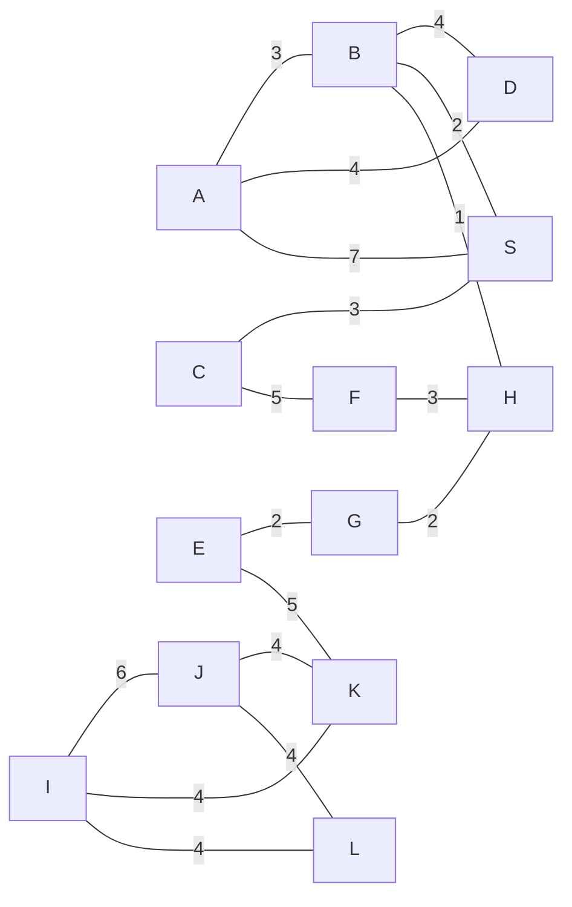

# Graph 2

[Home](README.md)

This is a Undirected Graph

```mermaid
graph LR
  A ---|3| B
  A ---|4| D
  A ---|7| S
  B ---|4| D
  B ---|2| S
  B ---|1| H
  C ---|3| S
  C ---|5| F
  E ---|2| G
  E ---|5| K
  F ---|3| H
  G ---|2| H
  I ---|6| J
  I ---|4| K
  I ---|4| L
  J ---|4| K
  J ---|4| L
```

## Pseudocode diagram
